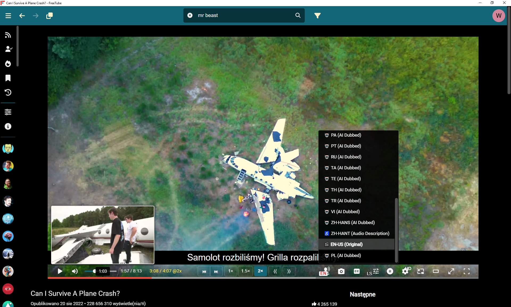

# FreeTubeMOD23.12

 
DOWNLOAD exe: https://github.com/marek7400/FreeTubeMOD23/releases/tag/FreeTubeMOD23

DOWNLOAD code: https://github.com/marek7400/FreeTubeMOD23/blob/main/FreeTubeMOD23.12-source_code.zip

Virustotal Analysis:
https://www.virustotal.com/gui/file/4c3b60ace0686740cf9c6de2beaa77c4c6d5c185b0071165f1f66adcbb7dfb88?nocache=1

Since no one wanted to add certain features to FreeTube or fix it, I decided to do it myself.
With the help of AI, after a few weeks of struggle, I managed to put something together.

FreetubeMOD21 changes:

-addition of a configurable progress bar 
(with chapter markers and movie thumbnails)

-added a recalculated time counter when speeding up the video 
(remaining time/total time@speed)

-added forward/backward frame jump icons

-added buttons for quick speed change: 1x 1.5x 2x

-addition of chapter skip forward/backward icons

-addition of the ability to load custom subtitles

-fixing the display of subtitles as 1-line subtitles

-configurable subtitles (including separate settings for full screen)

-when hovering over the control bar, the controls and mouse pointer do not disappear

-when the “Load with subtitles by default” option is enabled, subtitles are automatically disabled if the movie has audio in the same language as the system language

-disabling automatic translation of movie titles into English in the “Subscriptions” tab

-ability to switch audio tracks to other languages if available 
(requires downloading and entering the track into the yt-dlp.exe file)

**************************************************************************************************
Jako, że nikt nie chciał dodać pewnych rzeczy do FreeTube lub naprawić postanowiłem zrobić to sam.
Dzięki pomocy AI po kilku tygodniach walki udało się coś sklecić.

FreetubeMOD23.12 zmiany:

-dodanie konfigurowalnego paska postępu 
(ze znacznikami rozdziałów i miniaturkami filmu)

-dodanie przeliczonego licznika czasu jeżeli przyspieszamy film 
(pozostały czas/całkowity czas@prędkość)

-dodanie ikon skok klatka w przód/tył

-dodanie przycisków do szybkiej zmiany prędkości: 1x 1,5x 2x

-dodanie ikon skok rozdział w przód/tył

-dodanie możliwości ładowania własnych napisów

-naprawienie wyświetlania napisów jako napisy 1 wierszowe

-konfigurowalne napisy (w tym osobne ustawienia dla full screen)

-po najechaniu na pasek kontrolek nie znikają kontrolki ani wskaźnik myszki

-po włączeniu opcji "Domyślnie ładuj z napisami" napisy wyłączają się automatycznie jeśli film ma audio takie same jak język systemu

-wyłączenie automatycznego tłumaczenia tytułów filmów na angielski w zakładce "Subskrypcje"

-możliwość przełączania ścieżek audio na inne języki jeśli są dostępne 
(konieczne ściągnięcie i wpisanie ścieżki do pliku yt-dlp.exe)

